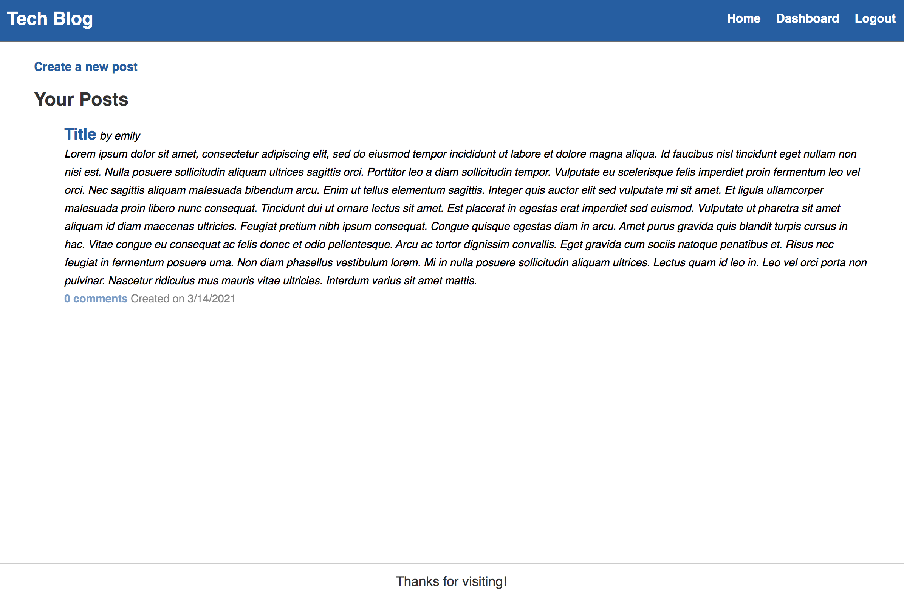

# Tech Blog

## Purpose
A heroku deployed web tech blog that allows you to create a username and password to signin, post, edit your posts, and see other's posts. 

## Built With 
* HTML 
* CSS
* JavaScript
* Bcrypt
* Sequelize
* Express
* Mysql2

## Website
[Click here](https://powerful-taiga-46589.herokuapp.com/dashboard)

## Screenshot

### Contribution
Made by Emily Kidd

### Contact
[GitHub](github.com/emilykidd3)  
[Email](mailto:e.kidd61@yahoo.com)